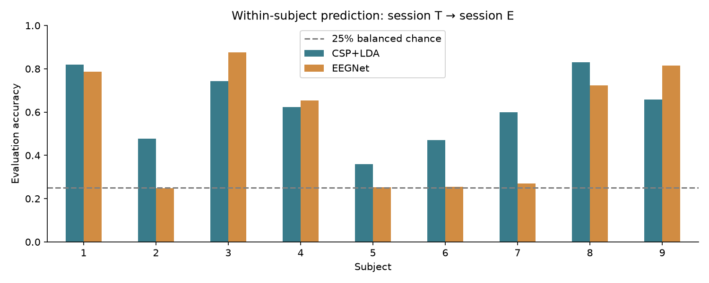

# Understanding the EEG motor-imagery experiment

This report explains the notebook from the recording through the final scores.
The experiment asks whether a model trained on one person's first recording
session can recognise four imagined movements in their second session. It
compares a spatial-feature baseline with a small convolutional network.

## What an EEG electrode records

EEG measures voltage differences at the scalp. Neurons move charged ions across
their membranes, and coordinated activity from large populations produces
electrical fields that scalp electrodes can detect. Much of the scalp signal
reflects summed postsynaptic activity in cortical neurons. An electrode does
not isolate a single neuron: its signal mixes activity over a broad region.
The recording also depends on the reference electrode. See the
[NCBI explanation of EEG signal generation](https://www.ncbi.nlm.nih.gov/books/NBK2510/)
and the [neuroscience chapter on synaptic summation](https://www.ncbi.nlm.nih.gov/books/NBK11104/).

Here, a channel is the voltage trace from one electrode location. A sample is
one measurement in time. A trial is the short interval associated with one
imagery instruction. The measurements are small, so we often draw them in
microvolts: one microvolt is `0.000001` volt. MNE expects EEG amplitudes in volts.

Blinking, eye movement, jaw tension, and electrical interference can also appear
in EEG recordings. A classifier may learn those signals if they correlate with
labels. Excluding the eye channels reduces one obvious source of unwanted input,
but eye and muscle activity can still contaminate the scalp channels.

## Why imagined movement changes the signal

During motor imagery, a participant mentally rehearses a movement while staying
still. Sensorimotor rhythms can change in strength during this task. The mu
rhythm is commonly studied around 8–13 Hz; beta activity around 13–30 Hz is also
relevant. Event-related desynchronisation (ERD) describes a reduction in rhythmic
power relative to a reference interval; synchronisation (ERS) describes an
increase. These terms concern power changes, not the literal disappearance or
appearance of brain activity. Pfurtscheller and Lopes da Silva explain the
mechanisms and interpretation in their [1999 paper](https://pubmed.ncbi.nlm.nih.gov/10576479/).

Different imagined movements can produce different spatial and spectral
patterns. These patterns vary between people and recordings. That is why this
notebook fits a separate model for each person. We expect noisy, overlapping
classes; there is no accuracy target built into the code.

The 8–30 Hz filter focuses the input on the chosen sensorimotor bands. It also
removes information outside that range. A wider band could be a separate
experiment, with the choice made using training data.

## The dataset used here

BCI Competition IV 2a has nine participants and four classes: left hand, right
hand, both feet, and tongue. Each person has two sessions recorded on different
days. A session contains six imagery runs of 48 trials, plus separate eye
calibration recordings. Signals have 22 EEG and three EOG channels sampled at
250 Hz. The [original dataset description](https://www.bbci.de/competition/iv/desc_2a.pdf)
shows the electrode layout and task timing.

The project reads the local BNCI MATLAB representation. The supplied folder
initially contained A01T.mat through A09T.mat. The nine E files come from the
[BNCI catalog](https://bnci-horizon-2020.eu/database/data-sets), which redirects
downloads to a Graz University of Technology mirror. This representation includes
the released evaluation labels. `data_sources.json` records their source URLs,
sizes, and SHA-256 hashes. The catalog also gives the data license and citation.

The [MOABB loader source](https://github.com/NeuroTechX/moabb/blob/develop/moabb/datasets/bnci/base.py)
documents the microvolt units and 1-based MATLAB marker indexing. We use the
same underlying dataset without asking MOABB to download another copy.

## From a MATLAB recording to NumPy arrays

`scipy.io.loadmat(..., simplify_cells=True)` converts the MATLAB structures to
Python objects. For each imagery run, the useful fields are:

| Field | Meaning | Use in the notebook |
|---|---|---|
| `X` | Continuous samples × 25 channels, in µV | Keep the first 22 channels |
| `trial` | 1-based start sample of each trial | Convert to zero-based indexing and add the cue offset |
| `y` | Class labels 1–4 | Subtract one for PyTorch labels 0–3 |
| `fs` | Sampling frequency | Check that it is 250 Hz |
| `artifacts` | Expert review flags, 0 or 1 | Exclude marked trials by default |

The initial calibration blocks have empty trial lists. They are not imagery
examples, so the loader skips them. See the
[SciPy `loadmat` documentation](https://docs.scipy.org/doc/scipy/reference/generated/scipy.io.loadmat.html)
for the structure conversion.

The cue appears two seconds after the trial starts. The code adds 500 samples
to each zero-based trial start and treats that as cue time. It then takes
0.5–3.5 seconds after the cue, equivalent to 2.5–5.5 seconds after trial start.
MNE includes both endpoints, so `(3.5 - 0.5) * 250 + 1 = 751` samples. Confusing
the trial marker with the cue would extract the wrong part of the recording.

After processing, the arrays have these shapes:

```python
X.shape  # (retained_trials, 22, 751)
y.shape  # (retained_trials,)

# Example: the complete, un-rejected session would have 288 trials.
# Artifact removal changes the first dimension.
one_channel = X[0, 7, :]   # C3 in the notebook's documented channel order
one_trial = X[0, :, :]     # All electrodes for the first retained trial
```

NumPy provides the arrays, MNE handles filtering and epoch construction,
scikit-learn handles CSP/LDA, and PyTorch trains EEGNet. Pandas writes tables and
Matplotlib draws the figures. The
[MNE analysis overview](https://mne.tools/stable/auto_tutorials/intro/10_overview.html)
explains how Raw, Epochs, and other MNE objects fit together.

## Preprocessing decisions

The loader converts µV to V and filters the continuous EEG in each imagery run
with a fourth-order Butterworth 8–30 Hz filter. MNE applies the zero-phase IIR
filter forward and backward; the effective response differs from a single pass.
Filtering before cutting trials reduces boundary effects at each short epoch.
Runs stay separate throughout filtering, including the run held out for
validation. See [MNE's filtering guide](https://mne.tools/stable/auto_tutorials/preprocessing/25_background_filtering.html)
for filter responses, ringing, and phase.

Zero-phase filtering uses samples on both sides of a time point, including
future samples. This is appropriate for the stated offline experiment. A live
BCI would need a causal filter and validation of its delay and streaming
behaviour. The competition's original evaluation also imposed causal predictions;
fixed-window scores here are not a reproduction of that original procedure.

By default, `DROP_ARTIFACTS = True` removes dataset-marked trials in T and E.
`preprocessing_audit.csv` records the total, flagged, and retained counts per run.
These flags do not guarantee that all remaining trials are free of artifacts.
The notebook performs no ICA or EOG regression. It does not subtract a pre-cue
baseline, resample the recordings, or change their reference.

## How CSP + LDA learns

An electrode contains a mixture of electrical sources. CSP learns new channel
combinations, called spatial filters, using the training labels. For an input
trial matrix `E` with channels × time, a filter matrix `W` gives `Z = W @ E`.
The transformed signals emphasise variance patterns that distinguish classes.
MNE supports the multiclass version used here. See the
[CSP API](https://mne.tools/stable/generated/mne.decoding.CSP.html).

The baseline retains six components. For each trial it calculates a log-power
feature for each component, resulting in a small feature vector. LDA learns
class-dependent means and a pooled covariance from these vectors. Shrinkage
helps covariance estimation with limited observations. The settings use
Ledoit-Wolf regularisation for CSP and automatic shrinkage for LDA.

The scikit-learn pipeline fits both stages on session T, then transforms and
predicts session E. Fitting CSP before a split would leak label information into
the representation. If you add cross-validation, put the whole pipeline inside
each fold. The [MNE motor-imagery example](https://mne.tools/stable/auto_examples/decoding/decoding_csp_eeg.html)
is a useful next exercise.

## How EEGNet learns

EEGNet receives a tensor shaped `(batch, 1, 22, 751)`. The extra dimension makes
the array compatible with PyTorch's two-dimensional convolutions. Electrode
locations form one axis and time forms the other.

| Stage | Operation | Purpose |
|---|---|---|
| Temporal | Eight convolutions along time | Learn short temporal patterns |
| Spatial | Two depthwise filters per temporal filter across 22 channels | Learn electrode mixtures |
| First pool | ELU, batch normalization, average pooling by 4, dropout | Reduce the time axis and regularise |
| Separable | Depthwise temporal convolution, then 1×1 mixing | Refine patterns and combine features |
| Second pool | ELU, batch normalization, average pooling by 8, dropout | Reduce the representation further |
| Classifier | Flatten and linear layer | Produce four class logits |

The model follows the EEGNet-8,2 structure with temporal kernels of 64 and 16
samples and dropout of 0.5. At 250 Hz, the first kernel spans 0.256 seconds. The
code constrains spatial and classifier weight norms. It uses Adam with weight
decay, a project choice beyond the basic architecture. Read the
[EEGNet paper](https://arxiv.org/abs/1611.08024) and
[authors' code](https://github.com/vlawhern/arl-eegmodels) for the original design.

Cross-entropy compares the logits with the correct class. Backpropagation
calculates how each parameter affects the loss, and Adam updates the parameters.
`nn.CrossEntropyLoss` expects logits, so the model does not put a softmax layer
before the training loss. See [PyTorch's loss documentation](https://docs.pytorch.org/docs/stable/generated/torch.nn.CrossEntropyLoss.html).

EEGNet can learn useful features, but it has more freedom to overfit than the
baseline. Its accuracy need not exceed CSP + LDA, especially with a small
training session. The comparison should be settled by held-out scores.

## What is kept out of training

Each person has their own T→E evaluation:

```text
T runs 1–5 -> fit normalization and EEGNet weights
T run 6   -> validation loss selects the epoch count
all T     -> fit new normalization and train a fresh EEGNet for that count
E         -> transform using all-T statistics, predict, and score once

all T     -> fit CSP + LDA
E         -> transform with fitted CSP, predict with fitted LDA, and score
```

The validation split uses complete runs rather than randomly mixing trials from
the same recording run. During selection, channel means and standard deviations
come only from fitting runs 1–5. A new fit on all T computes the final statistics.
The E data never defines those statistics. CSP and LDA also fit on T only.

Early stopping uses validation loss, with a patience of 50 and improvement
tolerance of `1e-4`. Selection has a maximum of 300 epochs. The best validation
epoch determines the final training budget; the final model is a fresh refit,
not the last model from selection. Curves record the selection stage.

The random seed is fixed per subject (`42 + subject`). CUDA settings request
deterministic cuDNN behaviour. Identical results across different hardware,
library versions, and drivers are not guaranteed; each run records its versions.

## Reading the outputs

Accuracy is the fraction of E trials with the right predicted label. Cohen's
kappa adjusts for expected agreement from the true and predicted class
frequencies. For a balanced example with chance agreement of 0.25, an accuracy
of 0.70 gives `(0.70 - 0.25) / (1 - 0.25) = 0.60` kappa. This is an arithmetic
example, not a measured project result.

The confusion matrix has true classes in rows and predicted classes in columns.
The diagonal contains correct trials. A large value in the left-hand row and
right-hand column means left-hand trials were often mistaken for right-hand
trials. Per-subject figures show counts; pooled figures show row percentages
with counts. The percentage denominator is the total number of true trials in
that row.

Training accuracy uses dropout while validation accuracy uses evaluation mode,
so their values are not measured under identical network conditions. Falling
training loss with rising validation loss suggests overfitting. A noisy
validation curve is plausible when the held-out run has only a few dozen trials.
Validation accuracy is not the final E accuracy.

`summary.csv` averages subject scores without weighting by trial count. Its
standard deviations describe variation across subjects, not confidence
intervals. With a single subject, standard deviation is undefined. The
majority-class reference chooses its class from T counts and scores that fixed
prediction on E. It helps contextualise uneven class counts after rejection.

## Results and their limits


The verified nine-subject run gave these subject-averaged scores:

| Model | Mean accuracy | Mean kappa |
|---|---:|---:|
| CSP+LDA | 62.0% | 0.495 |
| EEGNet | 54.2% | 0.388 |

EEGNet performs near chance for subjects 2, 5, 6, and 7 in this run. The validation loss selects short training budgets for these subjects. The baseline has the higher mean accuracy for the present settings. See [VERIFICATION.md](VERIFICATION.md) for the per-subject table and checks.



Per-subject results and completed checks are recorded in `VERIFICATION.md` and
the corresponding dated results folder. Do not replace measurements with expected
benchmark values. The notebook saves the exact settings, input hashes, retained
trial identities, model-selection history, and predictions for each run.

This is within-subject transfer between recording sessions. It cannot establish
accuracy for a new person, clinical usefulness, or a live device. Scores also
depend on filtering, epoch timing, artifact exclusion, validation choices, and
random initialisation. Comparing a number with a paper requires matching its
protocol. The [competition review](https://pmc.ncbi.nlm.nih.gov/articles/PMC3396284/)
provides context for the datasets and original scoring.

Further experiments could use nested run-wise validation on T to compare
frequency bands or CSP component counts, repeat neural-network training across
seeds, or investigate filter-bank CSP. Make these choices without using E as a
tuning set. Once E results guide changes, describe E as development data for
those comparisons and reserve another untouched test set for a final claim.

## A practical reading route

| Start here | What to learn | Try in this project |
|---|---|---|
| [EEG signal generation](https://www.ncbi.nlm.nih.gov/books/NBK2510/) | How population activity reaches scalp electrodes | Explain why one channel mixes sources |
| [ERD/ERS paper](https://pubmed.ncbi.nlm.nih.gov/10576479/) | Why power changes during tasks | Compare class-averaged spectra on T only |
| [Dataset description](https://www.bbci.de/competition/iv/desc_2a.pdf) | Cue timing, montage, trial design | Verify the two-second cue offset |
| [MNE overview](https://mne.tools/stable/auto_tutorials/intro/10_overview.html) | Raw recordings and epochs | Inspect the Raw and Epochs objects in the loader |
| [Filtering background](https://mne.tools/stable/auto_tutorials/preprocessing/25_background_filtering.html) | Filter phase and frequency response | Plot the response of the selected bandpass |
| [CSP tutorial](https://mne.tools/stable/auto_examples/decoding/decoding_csp_eeg.html) | Spatial filters and feature classification | Fit CSP inside a T-only validation fold |
| [EEGNet paper](https://arxiv.org/abs/1611.08024) | Compact temporal and spatial CNNs | Follow the tensor shape after each block |
| [PyTorch cross-entropy](https://docs.pytorch.org/docs/stable/generated/torch.nn.CrossEntropyLoss.html) | Logits and supervised loss | Inspect four logits from one trial |

To trace the implementation, start with `load_session`, then `make_baseline`,
`EEGNet.forward`, and `fit_eegnet`. Follow `X` and `y` through each stage before
changing hyperparameters. The README contains the VS Code and Anaconda launch
commands.
