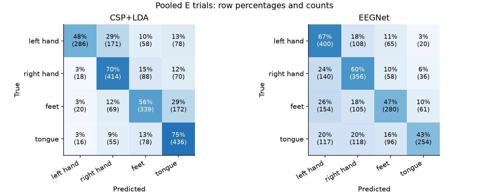

# Verified experiment results

Run: `results/20260916_013501_019980/`. All nine subjects used their own T→E split.

Execution used Python 3.11.16, the existing neuroAI environment, and the RTX 3060 Laptop GPU.

| Subject | CSP + LDA accuracy | CSP kappa | EEGNet accuracy | EEGNet kappa |
|---|---:|---:|---:|---:|
| 1 | 81.9% | 0.758 | 78.6% | 0.715 |
| 2 | 47.7% | 0.304 | 24.7% | -0.001 |
| 3 | 74.4% | 0.658 | 87.5% | 0.834 |
| 4 | 62.3% | 0.497 | 65.4% | 0.537 |
| 5 | 35.9% | 0.153 | 25.4% | -0.000 |
| 6 | 47.0% | 0.295 | 25.6% | 0.000 |
| 7 | 59.9% | 0.469 | 27.1% | 0.021 |
| 8 | 83.0% | 0.774 | 72.3% | 0.631 |
| 9 | 65.9% | 0.545 | 81.4% | 0.752 |
| Mean across subjects | 62.0% | 0.495 | 54.2% | 0.388 |

These are measured scores for the settings in the saved config, with dataset-marked
artifact trials excluded. They are offline, fixed-window within-subject scores.
The original competition required continuous causal output, so these are not its
official competition scores.

## What the results suggest

Performance varies substantially between subjects. For subject 3, EEGNet reaches
87.5% accuracy.
For subjects 2 and 5, the validation loss selects very short training budgets
(6 and 11 epochs), and the final E accuracy is near chance. Their fitting accuracy
improves later while held-out-run loss worsens. This suggests difficulty transferring
the learned patterns to that run, and makes this one-run validation choice worth
investigating with T-only run-wise cross-validation. It does not establish a cause.

The single seed and one validation run limit the comparison. A further study could
repeat seeds or select settings through nested validation on T. The present settings
were kept fixed after inspecting E; no trial or subject was discarded to improve
the reported model comparison.

## Checks completed

- Validated the notebook schema and parsed every code cell.
- Executed the pre-training cells in the environment's actual Jupyter kernel.
- Executed every notebook code cell for all nine subjects, including final checkpoint loading.
- Checked all 18 input hashes, 108 imagery runs, and artifact accounting.
- Recomputed every accuracy/kappa from saved predictions and checked subject means.
- Reloaded all nine EEGNet checkpoints and reproduced every saved E prediction.
- Checked subject 1's saved normalization against all-T statistics.
- Checked evaluation trial identities for duplicates and correct ordering.
- Inspected plots and tested .gitignore with Git on representative file paths.

Package versions and settings are in `config.json`; selection histories, predictions,
trial indices, and filtering counts remain alongside the result tables.

